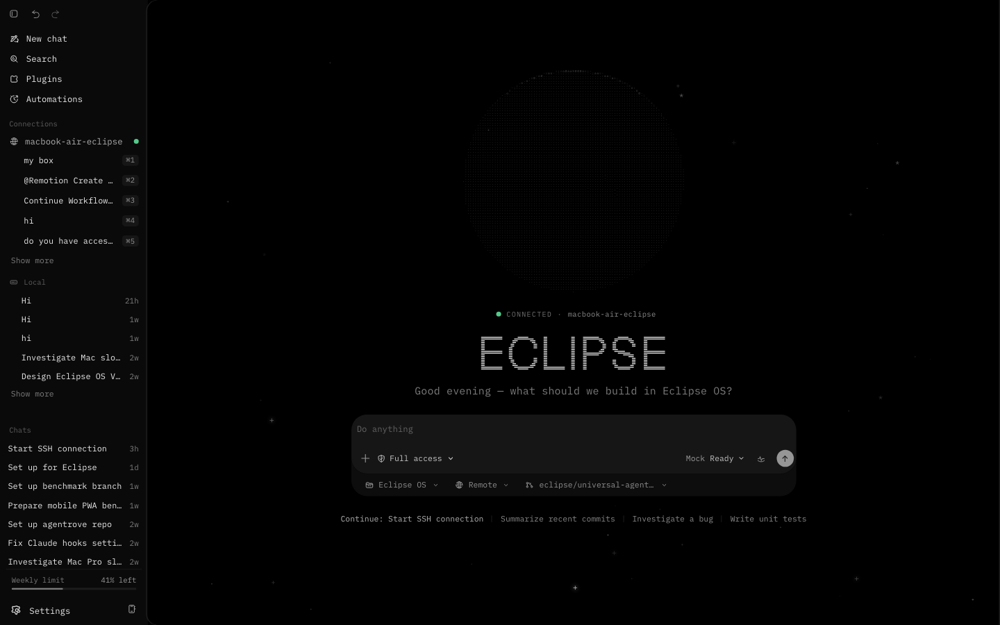
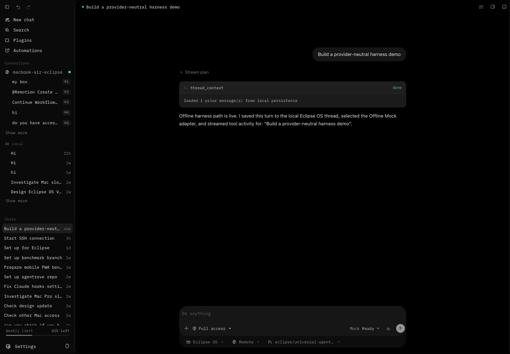

# Eclipse OS

Eclipse OS is a desktop-oriented AI agent harness. The current implementation keeps the approved Eclipse OS shell visual baseline intact while adding the first real harness path: provider selection, local persisted threads, streamed assistant/tool activity, and settings for adapter configuration.



The repository is a focused, runnable portfolio extract. It contains the desktop shell, provider contracts, Eclipse persistence layer, tests, and visual evidence without the private planning material from the wider application workspace.

## Current Harness Slice

- `apps/desktop-shell` renders the Eclipse OS desktop shell and settings surface.
- `packages/harness-core` defines provider-neutral message, stream, tool, auth, capability, registry, and adapter contracts.
- `packages/harness-eclipse` contains Eclipse-specific fixture events plus local thread/settings persistence.
- The desktop shell persists local threads/messages in browser storage and stores only the selected provider. API keys and CLI secrets are not stored in the browser.
- The conversation view streams through the adapter registry and renders reasoning/tool events with the existing Eclipse OS transcript styling.

## Supported Providers

| Provider | Status | Notes |
| --- | --- | --- |
| Offline Mock | Supported in the desktop shell | Deterministic local adapter for portfolio verification, no credentials required. |
| OpenAI Responses API | Adapter implemented, secure host required | Uses the official raw API shape behind injected `fetch` and `OPENAI_API_KEY`; the browser shell does not store or request keys. |
| Local CLI Agent | Contract implemented, secure host runner required | Uses the CLI's own authentication once a host runner is attached; no CLI secrets are stored by Eclipse OS. |

Unsupported today: ChatGPT consumer subscription sync, private ChatGPT endpoint access, account scraping, and treating ChatGPT subscriptions as OpenAI API credentials.

Official API reference used for the raw OpenAI adapter: https://platform.openai.com/docs/api-reference/responses/create

## Run Locally

```bash
pnpm install
pnpm run desktop:dev
```

Open `http://127.0.0.1:5173/`.

Useful checks:

```bash
pnpm run verify
```

## Visual Evidence

Curated screenshots for this slice live in `reference/codex/screenshots/portfolio-harness-2026-07-14/`.



- `before-desktop-main-1440.png` - canonical static desktop baseline before UI edits.
- `before-app-shell-1440.png` - runnable app shell baseline before UI edits.
- `final-app-shell-home-1440.png` - final desktop home state.
- `final-harness-conversation-1440.png` - real offline-adapter conversation with streamed tool activity.
- `final-settings-harness-general-1440.png` - settings surface with harness provider/secret-boundary card.
- `final-app-shell-home-390.png` - narrow viewport QA capture.

## Roadmap

- Add a secure host boundary for raw API providers so API keys live in env, OS keychain, or backend storage.
- Attach local CLI runners for authenticated tools such as Codex/OpenCode/OpenClaw through the common adapter contract.
- Add local import for user-exported conversation archives as a separate offline feature.
- Promote richer reasoning/tool components only through the existing component scout, lab import, tokenization, and visual QA flow.
- Expand persistence beyond browser storage when the desktop host storage boundary is ready.

## License

The code in this portfolio extract is available under the [MIT License](LICENSE).
