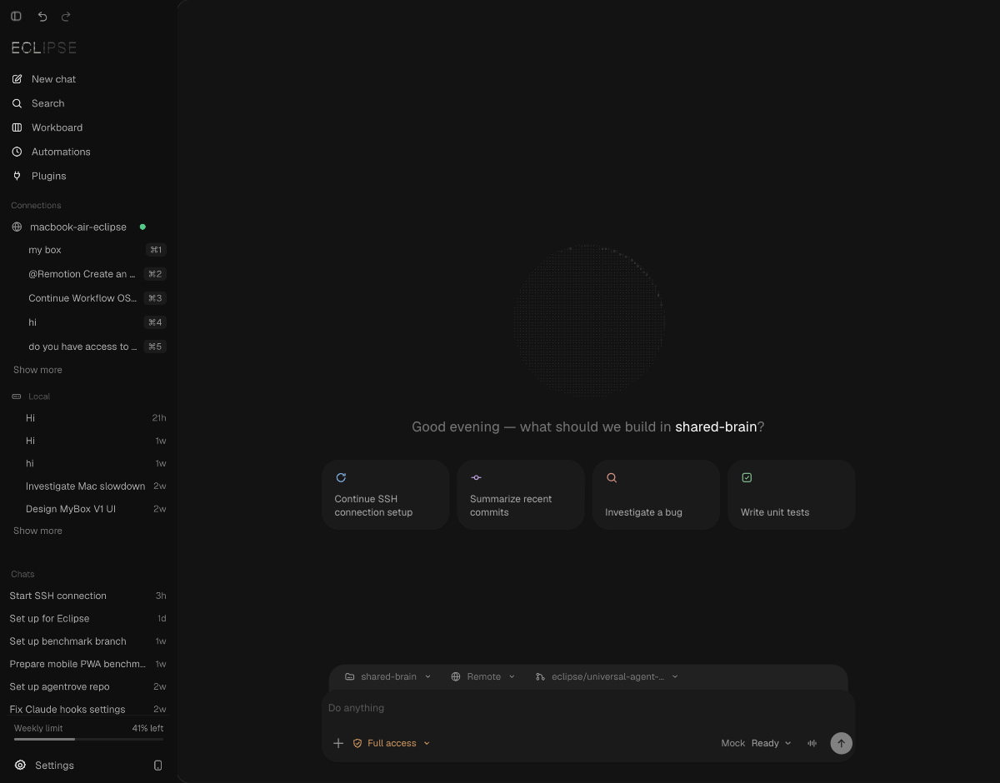
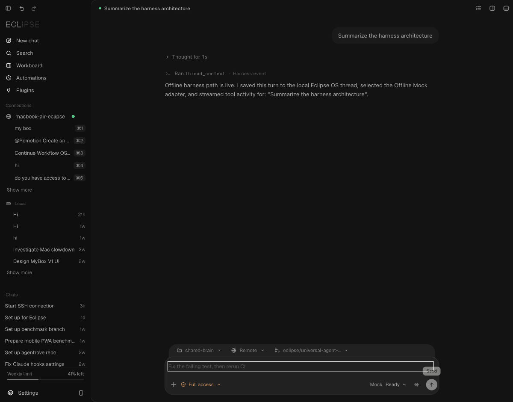
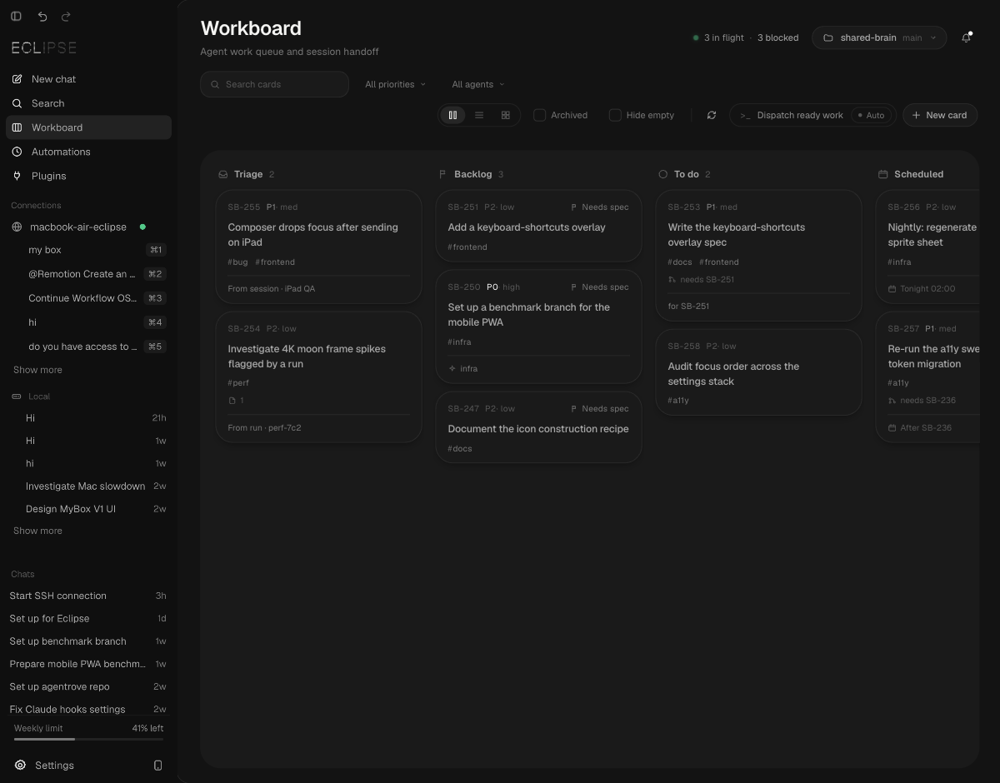
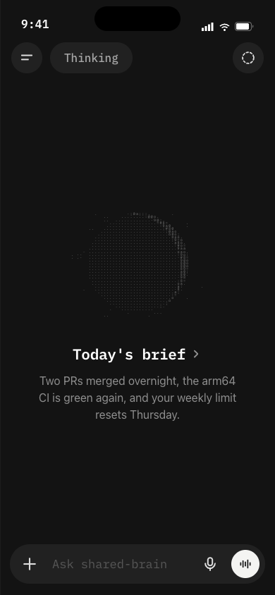

# Eclipse OS

Eclipse OS is a desktop interface for working with AI agents, local tasks, and development context in one place. This repository combines the intended Eclipse application shell with a small provider-neutral harness and local thread persistence.



## What works

- The canonical Eclipse desktop shell, including its command palette, environment panel, workspace Files/Browser/Diffs panel, themes, and Settings overlay.
- Embedded Workboard, Automations, and Plugins views that switch without reloading the shell.
- A working offline provider whose reasoning, tool activity, and assistant text are rendered through the Eclipse conversation UI.
- Provider selection and conversation records are written to browser storage when available. Restoring those records into the visible sidebar and transcript is not implemented yet.
- Provider contracts for the OpenAI Responses API and local authenticated CLI agents.
- The separate Eclipse mobile companion prototype and its pocket Workboard, Automations, and Plugins pages.



## Provider status

| Provider | Current state |
| --- | --- |
| Offline Mock | Runs entirely in the browser and requires no credentials. |
| OpenAI Responses API | Request and streaming adapter implemented; a secure host must supply `OPENAI_API_KEY` and perform the request. |
| Local CLI Agent | Adapter contract implemented; a desktop host runner must attach the authenticated CLI process. |

The model control in the composer cycles through these providers. Providers that cannot run safely in the browser are marked `Host` and return a clear setup response instead of requesting or storing secrets.

ChatGPT consumer subscriptions are not OpenAI API credentials. Account scraping, private ChatGPT endpoints, and subscription-chat synchronization are not implemented or claimed here.

## Product surfaces



Workboard, Automations, and Plugins are interactive local prototypes. Their current seed data and in-page actions demonstrate the intended workflows; they are not yet a durable job scheduler, remote execution service, or plugin sandbox.

The mobile companion is included for continuity, but the desktop shell is the canonical application.



## Repository layout

| Path | Purpose |
| --- | --- |
| `apps/desktop-shell/EclipseOS.html` | Canonical desktop UI with one nonvisual harness module import. |
| `apps/desktop-shell/public` | Settings, mobile pages, shared design tokens, assets, and embedded product modules. |
| `apps/desktop-shell/src/harnessBridge.ts` | Connects the existing composer and transcript to providers and local threads. |
| `packages/harness-core` | Provider registry, normalized stream events, auth boundaries, and adapters. |
| `packages/harness-eclipse` | Eclipse thread/settings persistence and harness fixture contract. |
| `tests` | Harness behavior and canonical-UI integrity tests. |

## Run locally

```bash
pnpm install
pnpm run desktop:dev
```

Open the local URL printed by Vite. The default is `http://127.0.0.1:5173/`.

Run the complete verification pass with:

```bash
pnpm run verify
```

The UI integrity tests verify that the desktop shell still matches the supplied visual authority except for the harness module tag, that every core surface remains present, and that all referenced local assets ship with the app.

## Source authority

The import provenance and SHA-256 hashes for the supplied application archive are recorded in [`docs/source-authority.json`](docs/source-authority.json). Private uploads, internal briefs, scraps, and historical working screenshots from that archive are deliberately excluded from this public repository.

## Next milestones

- Add a secure desktop host for raw API and authenticated CLI adapters.
- Replace seeded Workboard, Automations, and Plugins state with persistent stores and real harness actions.
- Restore persisted conversations into the sidebar and transcript on reload.
- Bundle the remaining remote development-only font and Tweaks-panel dependencies for a fully offline production build.

## License

The code in this repository is available under the [MIT License](LICENSE).
